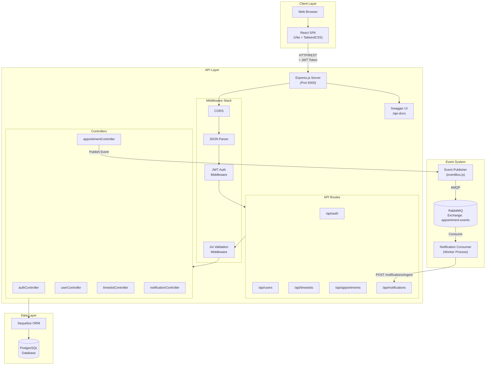

# System Architecture Document (SAD): Lecturer Appointment Booking System

## 1. System Overview

* **Purpose:** A web-based appointment scheduling platform that enables university students to discover lecturers, view their availability, and book appointments, while providing lecturers with tools to manage their time slots and approve/reject booking requests. The system implements real-time event processing for notifications using a message queue architecture.

* **Architecture Pattern:** **Hybrid Architecture** combining:
  - **Three-Tier Architecture** (Presentation → Application → Data)
  - **Event-Driven Architecture** for asynchronous notification processing
  - **MVC Pattern** within the backend (Models, Controllers, Routes)
  - **Component-Based Architecture** in the frontend (React components with Context API)

* **Primary Tech Stack:**
  | Layer | Technology |
  |-------|------------|
  | **Frontend** | React 18.2.0 + Vite 7.3.1 + TailwindCSS 3.4.1 |
  | **Backend API** | Node.js + Express 5.2.1 |
  | **Database** | PostgreSQL + Sequelize 6.37.7 ORM |
  | **Message Queue** | RabbitMQ (AMQP 0.10.8) |
  | **Consumer Service** | Node.js Worker Process |

## 2. High-Level Architecture Diagram



## 3. Component Architecture

### 3.1 Frontend / Client

* **Framework:** React 18.2.0 (Single Page Application)
* **Build Tool:** Vite 7.3.1 with Hot Module Replacement (HMR)
* **Module Type:** ES Modules (`"type": "module"`)
* **Development Server Port:** 3000 (with proxy to backend at 5000)

* **State Management:**
  - React Context API for global state
  - `AuthContext` - Authentication state, user session, JWT token management
  - `ThemeContext` - Light/dark mode toggle
  - Local component state with `useState` and `useEffect` hooks

* **Key Libraries:**
  | Library | Version | Purpose |
  |---------|---------|---------|
  | `react-router-dom` | 6.22.1 | Client-side routing with protected routes |
  | `axios` | 1.6.7 | HTTP client with request/response interceptors |
  | `dayjs` | 1.11.10 | Date/time formatting and manipulation |
  | `react-hot-toast` | 2.4.1 | Toast notifications for user feedback |
  | `react-icons` | 5.0.1 | Icon library (HeroIcons v2) |
  | `tailwindcss` | 3.4.1 | Utility-first CSS framework |

* **Directory Structure:**
  ```
  frontend/src/
  ├── api/           # Axios instance + service modules
  ├── components/    # Reusable UI components (common, layout, domain)
  ├── context/       # React Context providers
  ├── pages/         # Route-level page components
  ├── routes/        # Route configuration + guards
  └── styles/        # Global CSS + Tailwind imports
  ```

* **Routing Architecture:**
  - `PublicRoute` - Accessible without authentication (Login, Register)
  - `ProtectedRoute` - Requires valid JWT + role-based access control
  - Role-based route separation: `/student/*` and `/lecturer/*`

### 3.2 Backend / API Layer

* **Framework:** Express.js 5.2.1 on Node.js runtime
* **Module Type:** CommonJS (`require`/`module.exports`)
* **Server Ports:** 5000 (main API)

* **API Design:** RESTful JSON API
  | Endpoint Prefix | Resource | Methods |
  |-----------------|----------|---------|
  | `/api/auth` | Authentication | POST (register, login) |
  | `/api/users` | User profiles | GET (lecturers, me) |
  | `/api/timeslots` | Time slots | POST, GET, DELETE |
  | `/api/appointments` | Appointments | POST, GET, PUT |
  | `/api/notifications` | Notifications | POST (ingest), GET |
  | `/api-docs` | Swagger UI | GET |

* **Authentication:**
  - **Type:** JWT (JSON Web Token) Bearer Authentication
  - **Library:** `jsonwebtoken` 9.0.3
  - **Token Expiration:** 30 days
  - **Password Hashing:** `bcryptjs` 3.0.3 (salt rounds: 10)
  - **Token Storage:** Client-side `localStorage`
  - **Authorization Header Format:** `Authorization: Bearer <token>`

* **Middleware Pipeline (Order of Execution):**
  1. `cors()` - Cross-Origin Resource Sharing
  2. `express.json()` - JSON body parsing
  3. Route-specific: `protect` - JWT verification
  4. Route-specific: `authorize(...roles)` - Role-based access control
  5. Route-specific: `validate(schema)` - Joi request validation
  6. Controller execution
  7. `notFound` - 404 handler
  8. `errorHandler` - Global error handler

* **Request Validation:**
  - Library: `Joi` 18.0.2
  - Validation schemas in `/validators/` directory
  - Validates request body before controller execution

* **API Documentation:**
  - Library: `swagger-jsdoc` 6.2.8 + `swagger-ui-express` 5.0.1
  - OpenAPI 3.0.0 specification
  - Available at `/api-docs` endpoint

* **Directory Structure:**
  ```
  backend/
  ├── config/        # Database + Swagger configuration
  ├── controllers/   # Request handlers (business logic)
  ├── middleware/    # Auth, validation, error handling
  ├── models/        # Sequelize model definitions
  ├── routes/        # Express route definitions + Swagger docs
  ├── utils/         # Event bus utility
  ├── validators/    # Joi validation schemas
  └── tests/         # Jest test files
  ```

### 3.3 Data Layer

* **Primary Database:** PostgreSQL
  - Connection via `pg` driver 8.17.2
  - Environment-based configuration (DB_HOST, DB_PORT, DB_NAME, DB_USER, DB_PASS)

* **ORM:** Sequelize 6.37.7
  - Auto-migration enabled: `sync({ alter: true })`
  - Model associations defined in `/models/index.js`

* **Data Models:**

  | Model | Primary Key | Key Fields | Associations |
  |-------|-------------|------------|--------------|
  | `User` | id (INT) | name, email, password, role (ENUM) | hasMany TimeSlot, hasMany Appointment |
  | `TimeSlot` | id (INT) | lecturerId (FK), date, startTime, endTime, isBooked | belongsTo User, hasOne Appointment |
  | `Appointment` | id (INT) | studentId (FK), lecturerId (FK), timeSlotId (FK), status (ENUM) | belongsTo User (x2), belongsTo TimeSlot |
  | `Notification` | id (INT) | eventName, entityId, eventTimestamp, payload (JSONB) | None |

* **Entity Relationship Diagram:**
  ```mermaid
  erDiagram
      USER ||--o{ TIMESLOT : "creates (lecturer)"
      USER ||--o{ APPOINTMENT : "books (student)"
      USER ||--o{ APPOINTMENT : "receives (lecturer)"
      TIMESLOT ||--o| APPOINTMENT : "contains"
      
      USER {
          int id PK
          string name
          string email UK
          string password
          enum role "student|lecturer"
      }
      
      TIMESLOT {
          int id PK
          int lecturerId FK
          date date
          time startTime
          time endTime
          boolean isBooked
      }
      
      APPOINTMENT {
          int id PK
          int studentId FK
          int lecturerId FK
          int timeSlotId FK
          enum status "pending|approved|rejected|cancelled|completed"
      }
      
      NOTIFICATION {
          int id PK
          string eventName
          int entityId
          timestamp eventTimestamp
          jsonb payload
      }
  ```

* **Caching Strategy:** None detected - all queries hit the database directly

### 3.4 Message Queue / Event Processing

* **Message Broker:** RabbitMQ
  - Connection URL: `RABBITMQ_URL` environment variable (default: `amqp://localhost`)
  - Protocol: AMQP 0-9-1

* **Exchange Configuration:**
  - Name: `appointment.events`
  - Type: `fanout` (broadcasts to all bound queues)
  - Durability: `true` (survives broker restart)

* **Queue Configuration:**
  - Name: `notification-service`
  - Durability: `true`
  - Message acknowledgment: Manual (`noAck: false`)

* **Event Types Published:**
  | Event Name | Trigger | Payload |
  |------------|---------|---------|
  | `AppointmentCreated` | New appointment booking | `{ eventName, entityId, timestamp, meta: { studentId, lecturerId, timeSlotId } }` |

* **Consumer Service:**
  - Separate Node.js process (`/consumer/index.js`)
  - Processes events asynchronously with 2-second simulated delay
  - Ingests notifications via HTTP POST to `/api/notifications/ingest`
  - Token-based authentication: `x-notify-token` header

## 4. Data Flow & Request Lifecycle

### 4.1 Authentication Flow (Login)

```
1. Client sends POST /api/auth/login { email, password }
   │
2. Express receives request → cors() → json() middleware
   │
3. Route: validate(loginSchema) → authController.login()
   │
4. Controller: Sequelize User.findOne({ where: { email } })
   │
5. bcryptjs.compare(password, user.password)
   │
6. jwt.sign({ id, role }, JWT_SECRET, { expiresIn: '30d' })
   │
7. Response: { id, name, email, role, token }
   │
8. Client stores token in localStorage
```

### 4.2 Appointment Booking Flow (With Event Publishing)

```
1. Client sends POST /api/appointments { lecturerId, timeSlotId }
   │  Headers: Authorization: Bearer <jwt>
   │
2. Express middleware chain:
   │  cors() → json() → protect() → authorize('student') → validate()
   │
3. protect(): jwt.verify() → User.findByPk() → req.user = user
   │
4. authorize('student'): Verify req.user.role === 'student'
   │
5. appointmentController.createAppointment():
   │  a. TimeSlot.findByPk(timeSlotId)
   │  b. Validate: !isBooked, lecturerId matches
   │  c. User.findByPk(lecturerId) - verify lecturer exists
   │  d. Appointment.create({ studentId, lecturerId, timeSlotId })
   │  e. timeSlot.isBooked = true; timeSlot.save()
   │
6. Event Publishing:
   │  publishEvent({ eventName: 'AppointmentCreated', ... })
   │  → channel.publish(EVENT_EXCHANGE, '', message)
   │
7. Response: 201 Created { appointment }
   │
8. Async Event Processing:
   │  RabbitMQ → Consumer receives message
   │  → Consumer POSTs to /api/notifications/ingest
   │  → Notification.create({ ... })
```

### 4.3 Frontend Request Flow

```
1. User action triggers API call (e.g., appointmentService.bookAppointment())
   │
2. Axios interceptor attaches JWT from localStorage
   │
3. Request sent to http://localhost:5000/api/...
   │
4. Response received:
   │  ├─ Success: Return data to component
   │  ├─ 401: Clear localStorage, redirect to /login
   │  ├─ 403: Toast "permission denied"
   │  └─ 500: Toast "server error"
   │
5. Component updates state → React re-renders
```

## 5. External Integrations

| Service | Integration Point | Purpose | Authentication |
|---------|-------------------|---------|----------------|
| **RabbitMQ** | `amqplib` library | Asynchronous event messaging between backend and consumer | Connection URL (no auth in default config) |
| **PostgreSQL** | `pg` + Sequelize | Persistent data storage | Username/password via env vars |


## 6. Security Architecture

| Layer | Mechanism | Implementation |
|-------|-----------|----------------|
| **Transport** | [REQUIRES HTTPS] | Currently HTTP only; TLS termination needed for production |
| **Authentication** | JWT Bearer Tokens | 30-day expiry, HMAC-SHA256 signature |
| **Password Storage** | Bcrypt Hashing | 10 salt rounds |
| **Authorization** | Role-Based Access Control | `protect` + `authorize` middleware |
| **Input Validation** | Joi Schemas | Request body validation before controller |
| **CORS** | Express CORS Middleware | Currently allows all origins (configure for production) |
| **Error Handling** | Centralized Middleware | Stack traces hidden in production mode |
| **Token Security** | Client-side Storage | localStorage (consider HttpOnly cookies for production) |

## 7. Scalability Considerations

| Aspect | Current State | Recommendation |
|--------|---------------|----------------|
| **Database Connections** | Single Sequelize instance | Add connection pooling configuration |
| **Session Storage** | Stateless JWT | Already horizontally scalable |
| **Event Processing** | Single consumer process | Add multiple consumer instances with competing consumers |
| **Caching** | None | Add Redis for frequently accessed data (lecturers list, time slots) |
| **Load Balancing** | Not configured | Add reverse proxy (nginx) for multiple backend instances |
| **Static Assets** | Vite dev server | Deploy built files to CDN for production |

---

